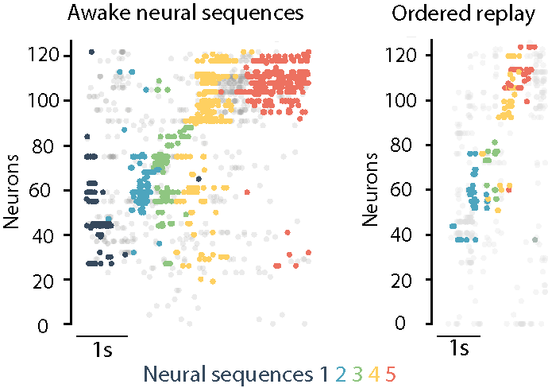

# Replay of Procedural Experience is Independent of the Hippocampus

This repository contains the code and data necessary to reproduce the figures from our publication: [Replay of Procedural Experience is Independent of the Hippocampus](https://www.biorxiv.org/content/10.1101/2024.06.05.597547v1.full.pdf).

Note:
- Plotting data are minimal (to save storage space) but sufficent to reproduce figures from the text. 
- Example data and preprocessing scripts are provided to outline data analysis pipelines prior to plotting. 
---------------------------------------------------------------------------------------------------------

## Overview

This repository includes:
- Scripts for producing the main figures from preprocessed data.
- A folder containing an example run of the preprocessing steps

## Getting Started

### Prerequisites

Ensure you have the following software installed:
- [Git](https://git-scm.com/)
- [Python](https://www.python.org/downloads/)  (Version used: 3.8.16)
- Necessary Python libraries (listed in `requirements.txt`) 

### Installation

1. **Clone this repository:**

   ```bash
   git clone [https://github.com/your-username/your-repo-name.git](https://github.com/EmmettJT/procedural_replay_paper_2024.git)

2. **Download the data file:**

Download the data file from [[this link](https://figshare.com/s/35340aa23920ba25c5a8)], unzip the data and move it to the same parent directory as the cloned folder (do not place the data file inside the cloned repo).

3. **Navigate to the cloned repository:**

   ```bash
   cd your-repo-name

4. **Install the required Python packages:**
  
    ```bash
    pip install -r requirements.txt

## Usage
Reproducing the Main Figures
To reproduce the main figures and statistics from the publication, run the tidied notebook scripts in the scripts directory. Each script corresponds to a specific figure in the paper.

## Preprocessing
For those interested in the preprocessing and analysis steps, the 'other' directory contains scripts containing preprocessing and untidied analysis. These scripts were used to prepare the data for the main analysis but are not very user firendly. Because of online storage space limitations a partial dataset is shared. The full extendend data set is available on request.

## License
This project is licensed under the MIT License. See the LICENSE file for details.

Copyright 2025 Emmett Thompson, University College London

